# Footnote¹

[](https://github.com/jordanpeele/footnote/actions/workflows/test.yml)

**Live fact-checks on your livestream, with sources, while you're still talking.**

Footnote listens to a live conversation, pulls out checkable claims, verifies them against high-trust sources, and puts a broadcast-quality verdict lower-third on the stream — seconds later, with a human holding the AIR button.

<!-- GIF: clip of live fact-check on stream — the overlay catching a false claim mid-sentence.
     Suggested: 960×540 (16:9), <8 MB, 10–15s loop, capture from the OBS program feed so the
     lower-third animates in over real video. Place at assets/demo.gif. -->
<!-- BADGES: license (MIT) · CI/eval status · good first issues count · link to hosted instance -->

Built for streamers, IRL broadcasters, debate shows, and anyone who talks about the news on camera. Verdicts are **True / False / Misleading / Needs Context / Unverifiable**, each with a one-line correction and a cited source — and the source is trust-tier ranked server-side, so what airs is always the most credible citation, never a Reddit thread.

## Architecture

```mermaid
flowchart LR
    A["🎙 live audio<br/>(mic / call tab / OBS bus)"] --> B["STT<br/>Deepgram streaming"]
    B -->|"final sentence"| C["claim extraction<br/>Claude Haiku<br/>/api/extract"]
    C -->|"atomic claim (or NONE)"| D["verification<br/>Perplexity sonar-pro<br/>trust-tiered sources<br/>/api/verify"]
    D -->|"verdict + correction + source"| E["operator queue<br/>/control<br/>AIR / SKIP / HOLD<br/>(or auto-air + veto window)"]
    E -->|"AIR"| F["state channel<br/>/api/onair (Redis)<br/>per-room, write-key gated"]
    F -->|"adaptive poll"| G["/overlay<br/>transparent lower-third"]
    G --> H["OBS Browser Source<br/>or Moblin widget"]
```



`/control` (the producer console) and `/overlay` (the graphic) run in separate browser processes — often separate machines — and are bridged by a per-room state channel. Rooms are capability URLs: the first writer registers the room's write key, the overlay just reads. Every stage is swappable (see [Plugin points](#plugin-points)).

The pipeline is deliberately **human-in-the-loop**: a check lands in the operator queue and only airs when a human airs it — or via confidence-gated auto-air with a veto countdown, where auto only takes definitive, high-confidence, sourced verdicts and a human can still pull anything. Airing a *wrong* fact-check is worse than airing none.

## Quickstart A — self-host (BYOK)

Clone → keys → running control room and overlay, in about two minutes. One Node ≥ 20 process, zero npm dependencies, no external store: locally the control→overlay state channel runs in-memory inside the server.

```sh
git clone https://github.com/jordanpeele/footnote && cd footnote
cp .env.example .env      # paste your three keys (Redis not needed locally)
npm start                 # → http://localhost:3000/control  +  /overlay?room=…
```

Or containerized, same thing: `docker compose up` (mounts the repo into `node:22-alpine`, reads `.env`, serves port 3000).

Bring your own keys:

| Key | For | Where to get it |
|---|---|---|
| `DEEPGRAM_API_KEY` | streaming speech-to-text | [deepgram.com](https://deepgram.com) — must be a **grant-capable key** (Member scope) so the server can mint short-lived browser tokens; your key never ships to the client |
| `ANTHROPIC_API_KEY` | claim extraction (Claude Haiku) | [console.anthropic.com](https://console.anthropic.com) |
| `PERPLEXITY_API_KEY` | verification (sonar-pro web search) | [perplexity.ai](https://perplexity.ai) |
| `KV_REST_API_URL` / `KV_REST_API_TOKEN` | state channel + rate limiting (Upstash Redis) | [upstash.com](https://upstash.com) — **not needed for self-host** (`npm start` defaults to the in-memory state channel, `FOOTNOTE_STATE=memory`); required on serverless deploys, or set `FOOTNOTE_STATE=upstash` locally to use it |

Then: open `/control`, allow the mic, hit **Start Stream**, say something checkable ("the Great Wall is visible from space"), and AIR the card that lands in the queue. Add the overlay URL from the OBS OVERLAY bar as a 1920×1080 Browser Source ([OBS_SETUP.md](./OBS_SETUP.md)).

## Quickstart B — deploy to Vercel (hosted)

[](https://vercel.com/new/clone?repository-url=https://github.com/jordanpeele/footnote&env=ANTHROPIC_API_KEY,PERPLEXITY_API_KEY,DEEPGRAM_API_KEY,KV_REST_API_URL,KV_REST_API_TOKEN&envDescription=Anthropic%20%2B%20Perplexity%20%2B%20grant-capable%20Deepgram%20key%2C%20and%20Upstash%20Redis%20REST%20credentials&envLink=https://github.com/jordanpeele/footnote%23quickstart-a--self-host-byok)

You'll be prompted for the same five env vars as above. Installing **Upstash** from the Vercel Marketplace sets `KV_REST_API_URL` / `KV_REST_API_TOKEN` automatically. Your deployment serves `/control` and `/overlay?room=…` — the overlay URL goes straight into an OBS Browser Source or a [Moblin Browser widget on a phone](./REMOTE_CALL_SETUP.md).

## Plugin points

Every vendor-touching stage sits behind a small interface, with the shipping vendor as the reference adapter. <!-- landing in sprint-01: interfaces + adapter layout (packet P0-B); exact file names may shift — the layout below is the contract -->

| Stage | Interface | Reference adapter | Build your own |
|---|---|---|---|
| **Verifier** (claim → verdict) | `src/core/interfaces/verifier.js` | `src/adapters/verifier/perplexity/` — sonar-pro + trust-tier citation ranking | Any search+synthesis stack (Brave/Exa + Claude, a RAG over your own archive…) — [walkthrough in CONTRIBUTING.md](./CONTRIBUTING.md#build-a-verifier-adapter) |
| **STT** (audio → final sentences) | `src/core/interfaces/stt.js` | `src/adapters/stt/deepgram/` — streaming WS, server-minted tokens | Local Whisper server, another cloud STT — [CONTRIBUTING.md](./CONTRIBUTING.md#other-adapter-domains) |
| **State channel** (control → overlay) | `src/core/interfaces/state-channel.js` | `src/adapters/state-channel/upstash-redis/` — REST, per-room, TOFU write key | Durable Objects, plain WebSocket relay, anything that can hold `{card, seq}` per room — [CONTRIBUTING.md](./CONTRIBUTING.md#other-adapter-domains) |
| **Overlay skin** (card → pixels) | `src/core/interfaces/overlay-skin.js` | `src/adapters/overlay/broadcast/` — the news lower-third | A skin is one HTML/CSS/JS bundle that renders a card — [CONTRIBUTING.md](./CONTRIBUTING.md#contribute-an-overlay-skin) |

There are drafted [good first issues](./launch/good-first-issues/) for one of each.

## The editorial layer

The interesting part of Footnote isn't the API calls — it's the rules about **what is allowed to reach the screen**. Those rules are written down in [`HOW_FOOTNOTE_DECIDES.md`](./HOW_FOOTNOTE_DECIDES.md): <!-- landing in sprint-01: packet P1-C --> what counts as a checkable claim, why sources are tiered and social/forums are blocklisted, why corrections are phrased *"per [source]"* and never as bare assertion, why auto-air only takes definitive verdicts and everything spicy waits for a human.

Treat that file as the spec. Accuracy-as-spec is the differentiator here: a fact-checker that's fast but sloppy is worse than no fact-checker, so changes to the editorial policy get a higher review bar than changes to code (see [CONTRIBUTING.md](./CONTRIBUTING.md#editorial-policy-changes)).

## Costs, limits, receipts

**This is BYOK and every check spends real money.** Deepgram streaming + one Haiku call per candidate sentence + one sonar-pro call per extracted claim works out to roughly **$0.50–1.00 per active streaming hour** across the three APIs, depending on how talkative the stream is. The Haiku gate exists to keep the expensive verify calls down.

- **Rate limits:** every API route is rate-limited per IP out of the box (`api/_ratelimit.js`); limits fail *open* if Redis is absent, so a keyless local setup runs unlimited. Tune the per-route limits at the call sites.
- **Receipts:** every aired check is appended to a durable per-room log (verdict, correction, source, timestamp) — the accountability record for anything Footnote ever put on a screen. Public receipts pages render that log per stream. <!-- landing in sprint-01: public receipts pages (packet P1-G); the log endpoint (`GET /api/onair?room=…&log=1`) exists today -->

## Docs

| Doc | What it covers |
|---|---|
| [`OBS_SETUP.md`](./OBS_SETUP.md) | Overlay + control in OBS, audio routing (virtual cables), producer controls |
| [`REMOTE_CALL_SETUP.md`](./REMOTE_CALL_SETUP.md) | Fact-checking a remote call, phone streaming with Moblin, the street rig |
| [`HOW_FOOTNOTE_DECIDES.md`](./HOW_FOOTNOTE_DECIDES.md) | The editorial policy — the spec for what airs <!-- landing in sprint-01 --> |
| [`eval/README.md`](./eval/README.md) | Golden claim set + calibration harness; how adapters prove themselves <!-- landing in sprint-01 --> |
| [`CONTRIBUTING.md`](./CONTRIBUTING.md) | Running locally, building adapters and skins, review bars |
| [`BACKLOG.md`](./BACKLOG.md) | Parked work and the triggers that un-park it |

## License

[MIT](./LICENSE)
