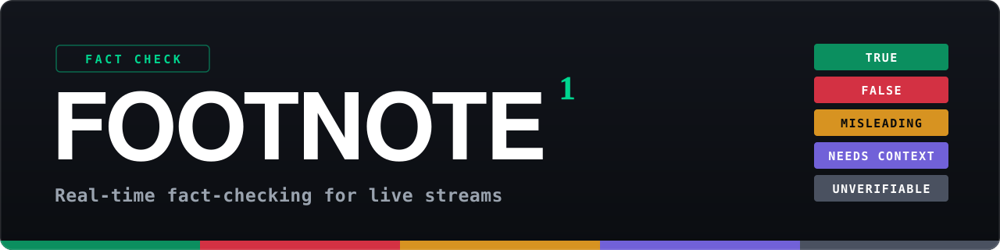
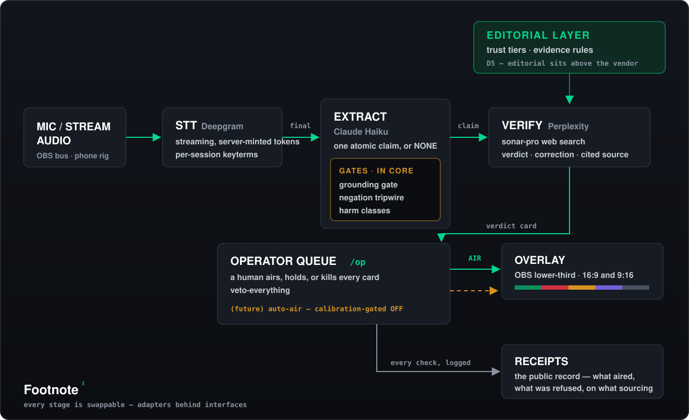

<p align="center">
  
</p>

[](https://github.com/jordanpeele/footnote/actions/workflows/test.yml)

Footnote listens to a live conversation, pulls out the checkable claims, verifies them against trust-tiered sources, and puts a broadcast lower-third verdict on the stream — with a human operator holding the AIR button. It runs as one Node process with zero npm dependencies, works in OBS on a desktop or from two phones on a sidewalk, and writes down everything it airs. Verdicts are **True / False / Misleading / Needs Context / Unverifiable**, each with a one-line correction and a cited source.

<!-- demo.gif lands from G4 -->

Just want to see it? `npm run demo`, then open http://localhost:3000/overlay?room=demo.

## The record so far

> **4 sessions · 102 checks · 1 wrong-verdict card aired (found, published, closed in code) · 1 display-incoherent pairing (found, published, closed in code)**

That sentence is the product. A fact-checker you can't audit is just a graphics package, so every session Footnote has run is written up with its failures attached: the [first field test](docs/FIELD_TEST_2026-08-08.md), the [street session](docs/FIELD_TEST_2026-08-10_STREET.md) (where both failures were found), and the calibration runs that decide what the machine is allowed to do on its own ([#1](docs/CALIBRATION_REPORT_2026-08-07.md), [#2](docs/CALIBRATION_REPORT_2_2026-08-07.md), [#3](docs/CALIBRATION_REPORT_3_TWOSTEP_2026-08-09.md) — current answer: nothing; a human airs every card). Both closures ship with regression tests.

## Quickstart — 60 seconds

```sh
git clone https://github.com/jordanpeele/footnote && cd footnote
cp .env.example .env.local   # paste your three keys
npm start                    # → http://localhost:3000/control  +  /overlay?room=…
```

Node ≥ 22, no `npm install`, no database — locally the control→overlay state channel runs in-memory inside the server. Open `/control`, allow the mic, say something checkable ("the Great Wall is visible from space"), and AIR the card that lands in the queue. The overlay URL goes into OBS as a Browser Source ([OBS_SETUP.md](OBS_SETUP.md)); portrait 1080×1920 canvases get a phone-safe vertical layout automatically.

## What you need

Footnote is **BYOK** — you bring three keys, and every check spends your money at the vendor. There is no shared backend: [footnote-live.vercel.app](https://footnote-live.vercel.app) is the maintainer's own instance of this repo, not a service you sign up for.

| Key | Does | Get it |
|---|---|---|
| `DEEPGRAM_API_KEY` | streaming speech-to-text | [deepgram.com](https://deepgram.com) — must be **Member scope** (grant-capable) so the server can mint short-lived browser tokens; your key never ships to the client |
| `ANTHROPIC_API_KEY` | claim extraction (Claude Haiku) | [console.anthropic.com](https://console.anthropic.com) |
| `PERPLEXITY_API_KEY` | verification (sonar-pro web search) | [perplexity.ai](https://perplexity.ai) |

Honest cost note: the optimization benches logged ~180 Perplexity verifies at roughly $2–3 all-in ([docs/LATENCY_LEDGER.md](docs/LATENCY_LEDGER.md)), and verify requests dominate spend — so a heavy hour of live checking runs a few dollars across the three APIs. The Haiku gate exists to keep the expensive verify calls down.

## Deploy to Vercel

[](https://vercel.com/new/clone?repository-url=https://github.com/jordanpeele/footnote&env=ANTHROPIC_API_KEY,PERPLEXITY_API_KEY,DEEPGRAM_API_KEY,KV_REST_API_URL,KV_REST_API_TOKEN&envDescription=Anthropic%20%2B%20Perplexity%20%2B%20grant-capable%20Deepgram%20key%2C%20and%20Upstash%20Redis%20REST%20credentials&envLink=https://github.com/jordanpeele/footnote%23what-you-need)

Serverless needs the two extra env vars for the state channel: `KV_REST_API_URL` / `KV_REST_API_TOKEN` (installing **Upstash** from the Vercel Marketplace sets them automatically). Your deployment serves `/control`, `/op`, `/overlay?room=…`, and `/receipts` — the overlay URL goes straight into an OBS Browser Source or a [phone rig](REMOTE_CALL_SETUP.md).

## Architecture

<p align="center">
  
</p>

The load-bearing decision is **D5: editorial sits above the vendor**. Source-trust ranking and verdict/evidence rules live in [`src/core/editorial.js`](src/core/editorial.js), above the verifier interface — so swapping Perplexity for something else cannot change what Footnote is willing to put on a screen. Same pattern for the extraction gates: the [grounding gate](src/core/grounding.js) (rejects extractions not grounded in what the speaker said), the [negation tripwire](src/core/polarity.js) (holds any card where speaker polarity is ambiguous), and harm-class tagging all sit in core, above the adapter seam.

`/control` (producer console) and `/overlay` (the graphic) run in separate browser processes — often separate machines — bridged by a per-room state channel. Rooms are capability URLs: the first writer registers the room's write key, the overlay just reads.

## Plugin points

Every vendor-touching stage sits behind a small interface, selected by env var ([`src/core/registry.js`](src/core/registry.js)), with the shipping vendor as the reference adapter:

| Stage | Interface | Reference adapter | Swap via |
|---|---|---|---|
| **Verifier** (claim → verdict) | [`src/core/interfaces/verifier.js`](src/core/interfaces/verifier.js) | [`src/adapters/verifier/perplexity/`](src/adapters/verifier/perplexity/) (a two-step variant exists, dark — it [failed its promotion eval](docs/CALIBRATION_REPORT_3_TWOSTEP_2026-08-09.md)) | `FOOTNOTE_VERIFIER` — [walkthrough](CONTRIBUTING.md#build-a-verifier-adapter) |
| **Claim extractor** (speech → atomic claim) | [`src/core/interfaces/claim-extractor.js`](src/core/interfaces/claim-extractor.js) | [`src/adapters/extractor/anthropic-haiku/`](src/adapters/extractor/anthropic-haiku/) | `FOOTNOTE_EXTRACTOR` |
| **STT** (audio → final sentences) | [`src/core/interfaces/stt-provider.js`](src/core/interfaces/stt-provider.js) | [`src/adapters/stt/deepgram/`](src/adapters/stt/deepgram/) | `FOOTNOTE_STT` — [notes](CONTRIBUTING.md#other-adapter-domains) |
| **State channel** (control → overlay) | [`src/core/interfaces/state-channel.js`](src/core/interfaces/state-channel.js) | [`src/adapters/state/upstash/`](src/adapters/state/upstash/) (local default: [`memory-ws`](src/adapters/state/memory-ws/)) | `FOOTNOTE_STATE` |
| **Overlay skin** (card → pixels) | [`overlay.html`](overlay.html) / [`overlay.js`](overlay.js) / [`overlay.css`](overlay.css) render the card; skin rules in [CONTRIBUTING.md](CONTRIBUTING.md#contribute-an-overlay-skin) | the broadcast lower-third | fork the bundle |

Verifier PRs ship with a golden-set run ([eval/](eval/README.md)) — "seemed right on the three claims I tried" is the failure mode this project exists to prevent.

## How it decides what airs

The interesting part isn't the API calls — it's the rules about what is allowed to reach the screen, and they're written down to be audited:

- **[HOW_FOOTNOTE_DECIDES.md](HOW_FOOTNOTE_DECIDES.md)** — the editorial policy. What counts as a checkable claim, the four-tier source hierarchy, verdict–evidence floors, the harm classes that can never auto-air, and the corrections rule (wrong verdicts get corrected on air, not deleted). Every rule is marked as either enforced-in-code or planned; divergence between code and an unmarked rule is a bug.
- **[docs/STREET_PROTOCOL.md](docs/STREET_PROTOCOL.md)** — the operator's one-page rulebook for live sessions. Rule 1: veto everything. Auto-air exists in the code but is calibration-gated and the current calibration answer is *no categories qualify*, so nothing airs without a human thumb.

Changes to the editorial policy get a higher review bar than changes to code ([CONTRIBUTING.md](CONTRIBUTING.md#editorial-policy-changes)).

## The street rig

Footnote doesn't need a desk: a phone streams the camera over SRT into OBS at home, stream audio feeds the pipeline, and the operator airs cards from `/op` on a second phone in their pocket — the whole rig ran a 90-minute sidewalk session over cell service ([field report](docs/FIELD_TEST_2026-08-10_STREET.md)). Build sheet and setup: [docs/STREET_RIG.md](docs/STREET_RIG.md).

## Community

- **[CONTRIBUTING.md](CONTRIBUTING.md)** — running locally, building adapters and skins, what review checks.
- **[Good first issues](https://github.com/jordanpeele/footnote/issues?q=label%3A%22good+first+issue%22)** — nine pre-drafted with exact file pointers, in [`launch/good-first-issues/`](launch/good-first-issues/): overlay skins, a verifier adapter, local-Whisper STT, i18n, eval sets.
- **[SECURITY.md](SECURITY.md)** — reporting vulnerabilities.
- **[docs/README.md](docs/README.md)** — index of everything else: field reports, calibration reports, latency ledger, red-team notes.

## License

[MIT](LICENSE)
